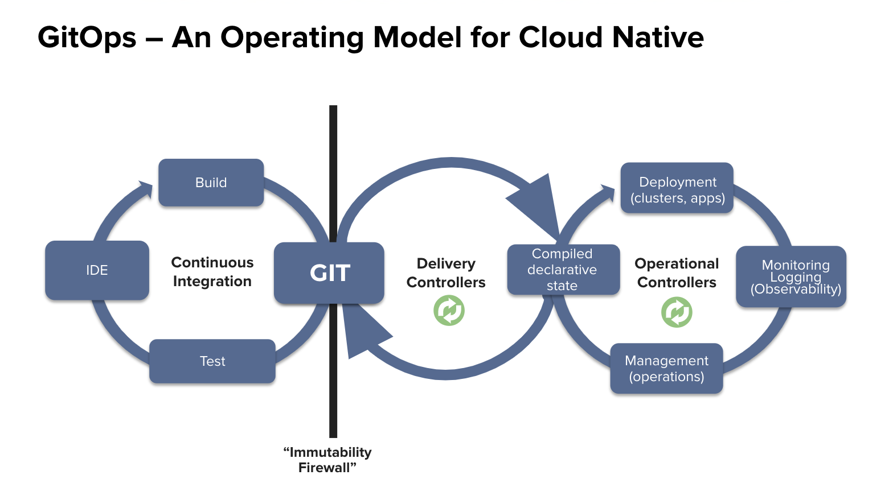
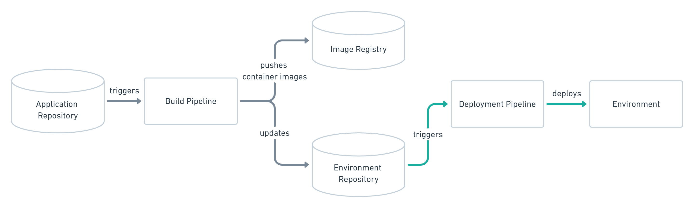
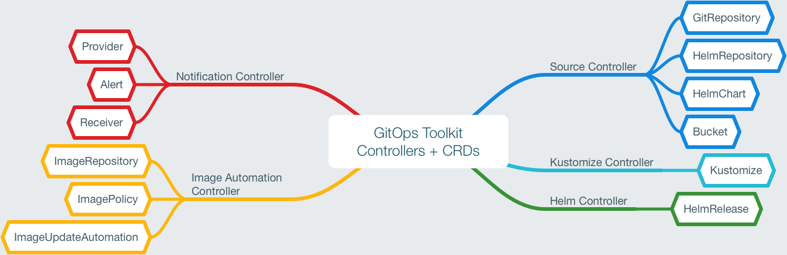
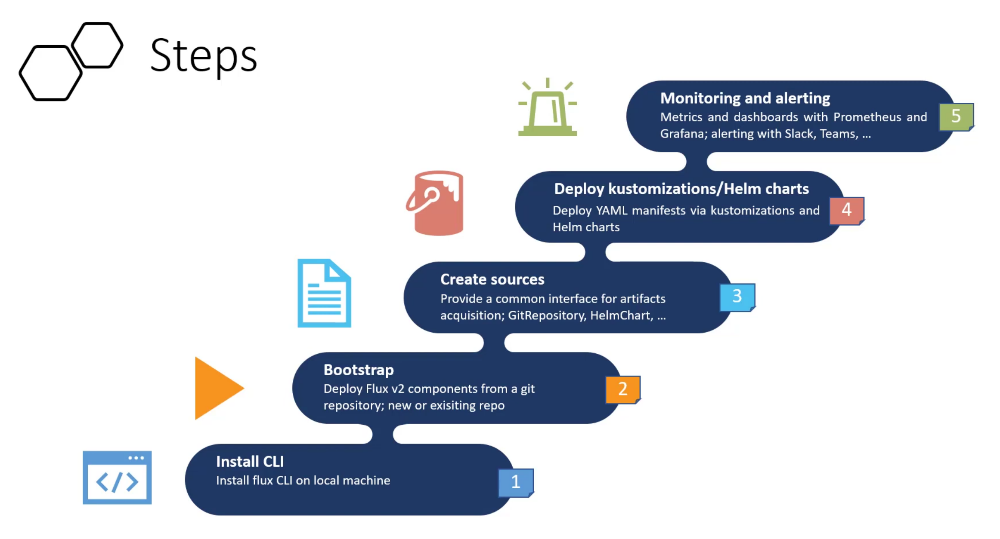
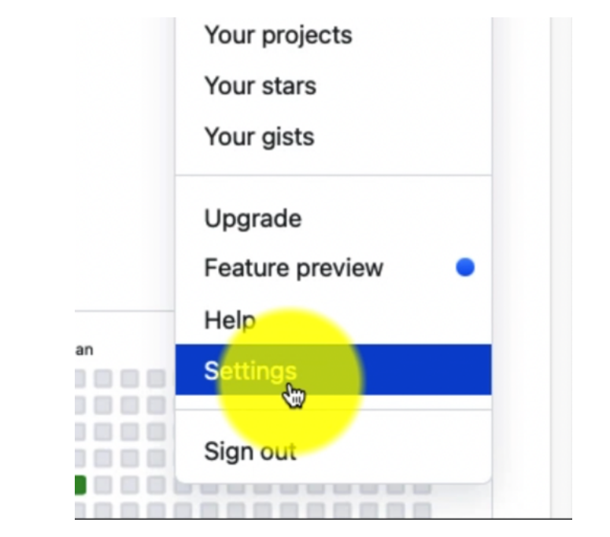
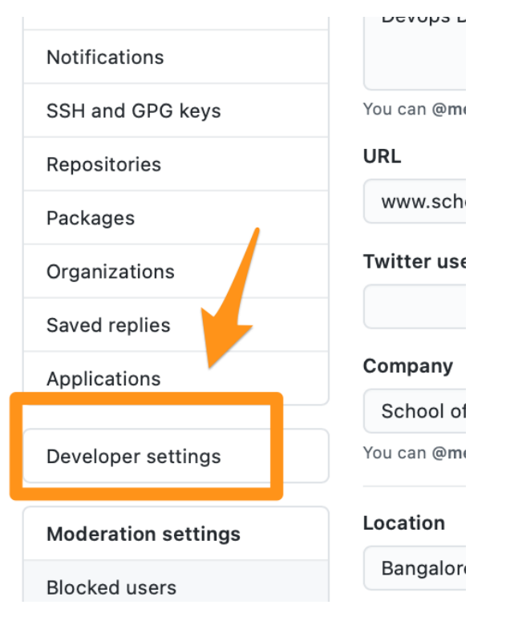
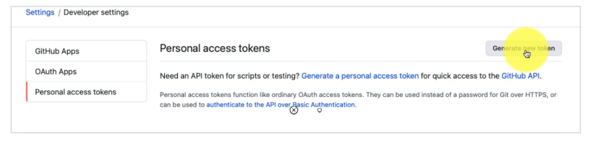
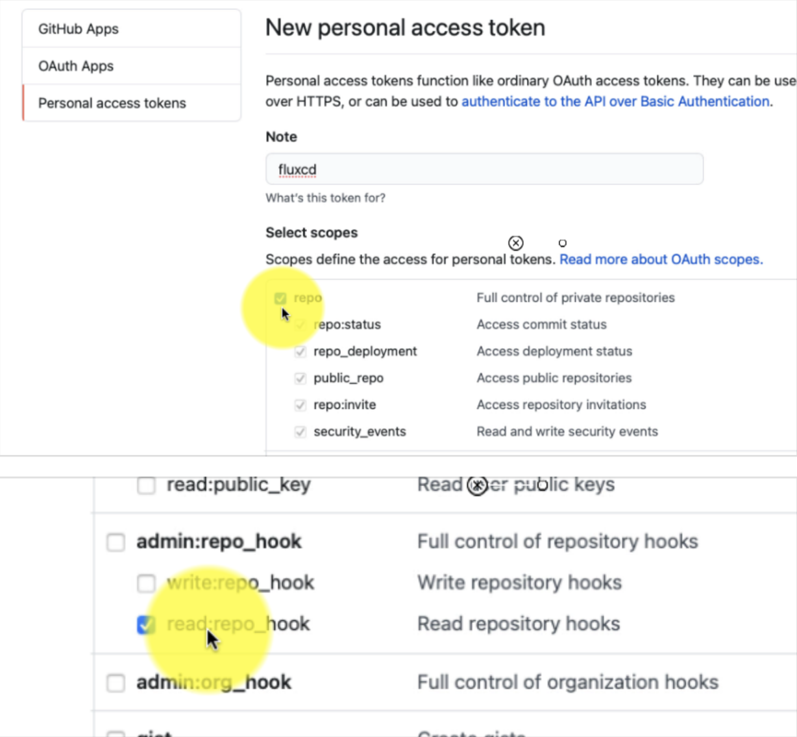
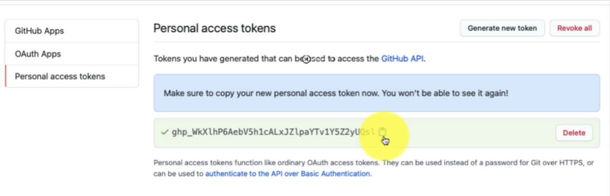

# Application Development Lifecycle Management for AKS using GitOps

## What is GitOps?

[GitOps](https://www.gitops.tech) is a way of implementing Continuous Deployment for cloud native applications. It focuses on a developer-centric experience when operating infrastructure, by using tools developers are already familiar with, including Git and Continuous Deployment tools.

The core idea of GitOps is having a Git repository that always contains declarative descriptions of the infrastructure currently desired in the production environment and an automated process to make the production environment match the described state in the repository. If you want to deploy a new application or update an existing one, you only need to update the repository - the automated process handles everything else. GitOps is also an operational framework for Kubernetes cluster management and application delivery. GitOps applies development practices like version control, collaboration, compliance, and continuous integration/continuous deployment (CI/CD) to infrastructure automation.
Since its inception in 2017 by [Weaveworks](https://www.weave.works/technologies/gitops), specially with the popularity rise of Kubernetes, GitOps has always been the top choice when it comes to infrastructure automation and continuous delivery.

GitOps organizes the deployment process around code repositories as the central element. There are at least two repositories: the application repository and the environment configuration repository. The application repository contains the source code of the application and the deployment manifests to deploy the application. The environment configuration repository contains all deployment manifests of the currently desired infrastructure of an deployment environment. It describes what applications and infrastructural services (message broker, service mesh, monitoring tool, …) should run with what configuration and version in the deployment environment.



There are two ways to implement the deployment strategy for GitOps: Push-based and Pull-based deployments. The difference between the two deployment types is how it is ensured, that the deployment environment actually resembles the desired infrastructure. When possible, the Pull-based approach should be preferred as it is considered the more secure and thus better practice to implement GitOps.

### Push-based Deployments

The Push-based deployment strategy is implemented by popular CI/CD tools such as Jenkins, CircleCI, or Travis CI. The source code of the application lives inside the application repository along with the Kubernetes YAMLs needed to deploy the app. Whenever the application code is updated, the build pipeline is triggered, which builds the container images and finally the environment configuration repository is updated with new deployment descriptors.

Tip: You can also just store templates of the YAMLs in the application repository. When a new version is built, the template can be used to generate the YAML in the environment configuration repository.



### Pull-based Deployments

The Pull-based deployment strategy uses the same concepts as the push-based variant but differs in how the deployment pipeline works. Traditional CI/CD pipelines are triggered by an external event, for example when new code is pushed to an application repository. With the pull-based deployment approach, the operator is introduced. It takes over the role of the pipeline by continuously comparing the desired state in the environment repository with the actual state in the deployed infrastructure. Whenever differences are noticed, the operator updates the infrastructure to match the environment repository. Additionally the image registry can be monitored to find new versions of images to deploy.


Just like the push-based deployment, this variant updates the environment whenever the environment repository changes. However, with the operator, changes can also be noticed in the other direction. Whenever the deployed infrastructure changes in any way not described in the environment repository, these changes are reverted. This ensures that all changes are made traceable in the Git log, by making all direct changes to the cluster impossible.

This change in direction solves the problem of push-based deployments, where the environment is only updated when the environment repository is updated. However, this doesn’t mean you can completely do without any monitoring in place. Most operators support sending mails or Teams notifications if it can not bring the environment to the desired state for any reason, for example if it can not pull a container image. Additionally, you probably should set up monitoring for the operator itself, as there is no longer any automated deployment process without it.

The operator should always live in the same environment or cluster as the application to deploy. This prevents the god-mode, seen with the push-based approach, where credentials for doing deployments are known by the CI/CD pipeline. When the actual deploying instance lives inside the very same environment, no credentials need to be known by external services. The Authorization mechanism of the deployment platform in use can be utilized to restrict the permissions on performing deployments. This has a huge impact in terms of security. When using Kubernetes, RBAC configurations and service accounts can be utilized.

## Flux CD and GitOps Toolkit



Weaveworks, company behind GitOps movement also created [Flux CD](https://fluxcd.io/) which is a popular GitOps tool and Kubernetes operator which as well as GitOps Toolkit. The [GitOps Toolkit](https://fluxcd.io/docs/components/) is the set of APIs and controllers that make up the runtime for Flux. GitOps Toolkit Controllers are:

- **Source Controller:** The main role of the source management component is to provide a common interface for artifacts acquisition. The source API defines a set of Kubernetes objects that cluster admins and various automated operators can interact with to offload the Git and Helm repositories operations to a dedicated controller.


- **Kustomize Controller:** The kustomize-controller is a Kubernetes operator, specialized in running continuous delivery pipelines for infrastructure and workloads defined with Kubernetes manifests and assembled with Kustomize.


- **Helm Controller:** The Helm Controller is a Kubernetes operator, allowing one to declaratively manage Helm chart releases with Kubernetes manifests.


- **Notification Controller:** The Notification Controller is a Kubernetes operator, specialized in handling inbound and outbound events.


- **Image reflector and automation controllers:** The image-reflector-controller and image-automation-controller work together to update a Git repository when new container images are available.
  
  - The image-reflector-controller scans image repositories and reflects the image metadata in Kubernetes resources.
  - The image-automation-controller updates YAML files based on the latest images scanned and commits the changes to a given Git repository.


## Using Flux V2

For using Flux v2 as a CD tool for Kubernetes Deployment automation we need to follow these steps:



### 1. Install Flux CLI and Related tools

In addition to [Git](https://git-scm.com/) for source control management, [Kubectl CLI](https://kubernetes.io/docs/tasks/tools/) and [Azure CLI](https://docs.microsoft.com/en-us/cli/azure/install-azure-cli) for Azure Managed Kubernetes Services (AKS), and correctly setting the current context for target cluster which should follow minimum requirement, you must at least have [Flux CLI](https://fluxcd.io/) installed as well. For installation follow the official guide [here](https://fluxcd.io/docs/installation/). Optionally you may install additional CLIs such as [Kustomize](https://kustomize.io/) or [Helm](https://helm.sh/) depending on the requirements. To make sure you are following minimum requirements make sure run the following command:

```sh
flux check --pre
```

which should result in something like below:

> ► checking prerequisites  
✔ Kubernetes 1.20.9 >=1.19.0-0  
✔ prerequisites checks passed

Now you are ready to proceed.

### 2. Bootstrap

> **Prerequisite:** for creating new git repository, allowing check-ins or even reading from private repository for bootstrapping, flux needs repository permission which can be achieved by creating a Personal Access Token with full repository access. Follow these steps if you don't know how to do it.  
>

> *Login to GitHub and go to settings:*  


> *From account Settings, select Developer Settings:*  


> *Choose Personal Access Token and click on Generate:*  


> *Provide a name for the token, select full repo access, along with admin:repo_hook →
read:repo_hook and click on Create:*  


> *Retain the page which displays the token (one time) until you set the environment variables in your shell permanently:*  


> Set up the environment variables, preferably permanently, in the shell profile script by adding
the following lines in ~/.bashrc or the equivalent file for your shell.
Make sure you have replaced the values of the token and user with the actual values, by
removing < >
> ```sh
> export GITHUB_TOKEN=<your-personal-access-token>
> export GITHUB_USER=<your-github-username>
> ```

Flux Bootstrap deploys GitOps Toolkit Custom Resource Definitions, controllers and other sync settings for Flux System (usually in flux-system namespace) along with storing it in the new or existing git repository. It is also an Idempotent process meaning you can bootstrap multiple times and it will result the same. These can be stored in a stand-alone repository or coexist in the same repository with other infrastructure codes and even application source codes.  
Based on your application scope, team or teams working on the app and environment requirements, There are different ways you can structure your repositories.  

> checkout official guide for [ways of structuring your repositories](https://fluxcd.io/docs/guides/repository-structure/)

You can bootstrap for a [Generic git Repository](https://fluxcd.io/docs/cmd/flux_bootstrap_git/) or a targeted specific git repository type such as [GitHub](https://fluxcd.io/docs/cmd/flux_bootstrap_github/). Optionally you can define additional variables for repository and cluster name:

```sh
flux bootstrap github \
--owner=$GITHUB_USER \
--repository=$GITHUB_REPO \
--branch=main \
--path=./clusters/$CLUSTER_NAME \
--personal
```

Some of the most notable options are as follows:

- **Personal or Org and Team Access:** Combination of --personal (Boolean) --owner (string) and --team (string) flag. Set owner to $GITHUB_USER and $GITHUB_TOKEN will be pulled automatically
- **Private or Public Repo:** --private (Boolean)
- **Branch and/or Path:** --branch string and --path safeRelativePath
- **Repository Name:** --repository which can be existing one or new one

### 3. Create and Deploy w Git Source and Kustomize

First thing is to create source whether its the same repository or different repository we need to create the git source. following command will not execute the create directly to cluster and use declarative approach to export the source file instead to the cluster as a yaml file (use export option):

```sh
flux create source git demo \
--url=https://github.com/$GITHUB_USER/$GITHUB_REPO \
--branch=main \
--interval=30s \
--export > ./clusters/$CLUSTER_NAME/demo-source.yaml
```

Assuming we are following the single repository pattern explained in repository structuring documentation [here](https://fluxcd.io/docs/guides/repository-structure/) and have to create kustomize under infrastructure folder like the tree below:

```txt
├── apps
│   ├── base
│   ├── production 
│   └── staging
├── infrastructure
│   ├── base
│   ├── production 
│   └── staging
└── clusters
    ├── production
    └── staging
```

We would have something like this for creating kustomization for dev environment for instance:

```sh
flux create kustomization demoapp-dev \
--source=demo \
--path="./infrastructure/overlays/dev" \
--prune=true \
--health-check="Deployment/demoapp-dev.demoapp-dev" \
--health-check="Deployment/redis-dev.demoapp-dev" \
--health-check-timeout=2m \
--export > ./clusters/$CLUSTER_NAME/demoapp-dev.yaml
```

Similarly, we can create kustomization for another environment like prod:

```sh
flux create kustomization demoapp-prd \
--source=demo \
--path="./infrastructure/overlays/prd" \
--prune=true \
--interval=1m \
--health-check="Deployment/demoapp-prd.demoapp-prd" \
--health-check="Deployment/redis-prd.demoapp-prd" \
--health-check-timeout=2m \
--export > ./clusters/$CLUSTER_NAME/demoapp-prd.yaml
```

> Note: example above showed a single repository but, it would have not been much different if we had multiple repositories or even multiple clusters (in case of multi-clusters we should have bootstrapped for all clusters)

### 4. Create and Deploy Helm Charts

Similar to Kustomization, for helm deployments we should create the source first. following example shows how to add popular **bitnami** helm repository as a source:

```sh
flux create source helm bitnami \
--url=https://charts.bitnami.com/bitnami \
--interval=1m0s \
--export > ./clusters/$CLUSTER_NAME/helmrepo-bitnami.yaml
```

After we added the source, we can create **Helm Release** for a chart/package defined in that source. following example demonstrate Redis for instance:

```sh
flux create helmrelease redis \
--source=HelmRepository/bitnami \
--chart redis \
--release-name redis \
--target-namespace default \
--interval 5m0s \
--export > ./clusters/$CLUSTER_NAME/helmrelease-redis.yaml
```

After export, we can further modify the generated file at anytime.  

For packaging custom code into helm chart, we can use any container registry that supports Helm. Azure Container Registry (ACR) is a good choice as it helm charts as well as container images all with great security and built-in RBAC policies. similar to any helm source we can define custom helm source hosted in ACR like below:

```sh
flux create source helm demoapp \
--url https://{Your ACR}.azurecr.io/helm/v1/repo/ \
--interval 1m0s \
--secret-ref acr \
--export > ./clusters/$CLUSTER_NAME/helmrepo-demoapp.yaml
```

Now that we have our custom helm source, we need to package our app as helm chart. But first, we need to set Helm Open Container Initiative experimental flag:

```sh
export HELM_EXPERIMENTAL_OCI=1
```

Then we can save the chart using following command which saves the chart locally:

```sh
helm chart save . {Your ACR}.azurecr.io/demoapp:1.0.0
```

For more information about how to build helm chart for your app, refer to [helm documentations](https://helm.sh/docs/)

Then we need to login to helm registry (e.g. ACR)

```sh
helm registry login {Your ACR}.azurecr.io
```

Now we push the chart to your registry (e.g. ACR)

```sh
helm chart push {Your ACR}.azurecr.io/demoapp:1.0.0
```

This will archive the app and push it to ACR (in this example in dmeoapp repository and creates tag 1.0.0 automatically)

Last but not least, we need to tell Flux how to get chart from ACR and for that we can create a secret in AKS (which can be backed by Azure KeyVault) like below:

```sh
kubectl create secret generic acr --from-literal username={yourACRName} --from-literal "password={yourACRAdminPassword}" -n flux-system
```

Now all we need is to create our custom helm release with everything in place:

```sh
flux create helmrelease demoapp \
--source=HelmRepository/demoapp \
--release-name demoapp \
--target-namespace default \
--interval 5m0s \
--export > ./clusters/$CLUSTER_NAME/helmrelease-demoapp.yaml
```

### 5. Monitoring and Alerting

One of GitOps Toolkit Components that is shipped as part of Flux package and create CRD in AKS is Notification Controller which is a Kubernetes operator, specialized in handling inbound and outbound events. In Addition to monitoring, it gives flux capability to integrate Messaging Apps like Microsoft Teams with ADLM and GitOps Events.

Even Better, there is a nice out-of-box template available by Flux Team for enabling Prometheus and Grafana for AKS cluster. All we need to do is to add a Source to the FluxV2 Official Git Repository:

```sh
flux create source git monitoring \
--interval=30m \
--url=https://github.com/fluxcd/flux2 \
--branch=main \
--export > ./clusters/$CLUSTER_NAME/monitor-source.yaml
```

Then we create kustomization for the Prometheus/Grafana that is provided by FluxCD team like below:

```sh
flux create kustomization monitoring \
--interval=1h \
--prune=true \
--source=monitoring \
--path="./manifests/monitoring" \
--health-check="Deployment/prometheus.flux-system" \
--health-check="Deployment/grafana.flux-system" \
--export > ./clusters/$CLUSTER_NAME/monitor-kustomization.yaml
```

We can check the reconciliation status with `Flux get all` command and locally we can simply check the Grafana dashboard using kubectl:

```sh
kubectl -n flux-system port-forward svc/grafana 3000:3000
```

For **Microsoft Teams** integration, we need to add secure Teams Webhook URL as a secret in Kubernetes:

```sh
kubectl -n flux-system create secret generic teams-url --from-iteral https://outlook...
```

Notification and alerting also works for source control as well and can be a used as a powerful tool for release feedback and real-time pipeline/action feedbacks.
For more information on notification and webhook setups check out official guides:

- <https://fluxcd.io/docs/guides/notifications/>
- <https://fluxcd.io/docs/guides/webhook-receivers/>

## Multi-Cluster , Multi-Cloud and Hybrid Solution with Azure Arc-enabled Kubernetes

If you are dealing with Multi-Cluster, Multi-Cloud or Even Hybrid Solutions it might be easier, and more secure to use Azure Arc-enabled Kubernetes Services which is offered at no additional cost other AKS regular cost that provides a huge value for cluster management.  

GitOps with Flux v2 can be enabled in Azure Arc-enabled Kubernetes connected clusters or Azure Kubernetes Service (AKS) managed clusters as a cluster extension.

This can be done using Azure CLI and AKS-ExtensionManager. Make sure you have at least Azure CLI 2.15 installed and then run `az upgrade` to get the latest CLI. Also make sure you have all the necessary features enables:

```sh
az feature register --namespace Microsoft.ContainerService --name AKS-ExtensionManager
```

Registration of the following Azure service providers. (It's OK to re-register an existing provider.) Registration is an asynchronous process and should finish within 10 minutes:

```sh
az provider register --namespace Microsoft.Kubernetes
az provider register --namespace Microsoft.ContainerService
az provider register --namespace Microsoft.KubernetesConfiguration
```

Install the latest k8s-configuration and k8s-extension CLI extension packages:

```sh
//install
az extension add -n k8s-configuration
az extension add -n k8s-extension

//or update
az extension update -n k8s-configuration
az extension update -n k8s-extension
```

Apply a Flux configuration by using the Azure CLI
Use the k8s-configuration Azure CLI extension (or the Azure portal) to enable GitOps in an AKS or Arc-enabled Kubernetes cluster. For a demonstration, use the public [flux2-kustomize-helm-example](https://github.com/fluxcd/flux2-kustomize-helm-example) repository. In the Following example:

- The resource group that contains the cluster is flux-demo-rg.
- The name of the Azure Arc cluster is flux-demo-arc.
- The cluster type is Azure Arc (connectedClusters), but this example can also work with AKS (managedClusters).
- The name of the Flux configuration is gitops-demo.
- The namespace for configuration installation is gitops-demo.
- The Git repository branch is main.
- The scope of the configuration is cluster. It gives the operators permissions to make changes throughout cluster.
- Two kustomizations are specified with names infra and apps. Each is associated with a path in the repository.
- The apps kustomization depends on the infra kustomization. (The infra kustomization must finish before the apps kustomization runs.)
- Set prune=true on both kustomizations. This setting assures that the objects that Flux deployed to the cluster will be cleaned up if they're removed from the repository or if the Flux configuration or kustomizations are deleted.

```sh
az k8s-configuration flux create -g flux-demo-rg -c flux-demo-arc -n gitops-demo --namespace gitops-demo -t connectedClusters --scope cluster -u https://github.com/fluxcd/flux2-kustomize-helm-example --branch main  --kustomization name=infra path=./infrastructure prune=true --kustomization name=apps path=./apps/staging prune=true dependsOn=["infra"]
```

> For Complete Guide Please checkout [GitOps FluxV2 Tutorial](https://docs.microsoft.com/en-us/azure/azure-arc/kubernetes/tutorial-use-gitops-flux2)
>
> There is also another [Tutorial for CI/CD with Flux V2](https://docs.microsoft.com/en-us/azure/azure-arc/kubernetes/tutorial-gitops-flux2-ci-cd)
>

## Putting everything together w GitHub CodeSpaces

1. Create New Private Repo or Clone this Repo. make note of **GITHUB_REPO** Configure security correctly (Lock main branch checkin pro feature)
2. Open Codespaces (Beta or Subscription required)
3. Download Flux by using Codespaces terminal bash:

    ```bash
    curl -s https://fluxcd.io/install.sh | sudo bash
    ```

4. Run codespaces bash terminal in elavated mode:

    ```bash
    sudo -i
    ```

5. Run `az login` and follow the instruction to login
6. Run az aks create to create new cluster and make note of  **CLUSTER_NAME** and **RESOURCE_GROUP_NAME**
7. Go to GitHub Organization Settings under user, go to developer settings and under Personal Access Tokens create one that has full access to the repository and make note of **GITHUB_TOKEN** generated as well as **GITHUB_USER** that you are acting on behalf of.
8. Export all of the notes as parameters:

```bash
export GITHUB_TOKEN=ghp_****************
export GITHUB_USER=pakbaz
export GITHUB_REPO=flux-single-repo
export CLUSTER_NAME=k8s_cluster
export RESOURCE_GROUP_NAME=k8s_rg
```

9. Run the following command to connect to AKS and merge credentials into current context:

```bash
az aks get-credentials -n $CLUSTER_NAME -g $RESOURCE_GROUP_NAME
```

10. Now to make sure everything is correctly set, run the flux precheck to make sure everything is in order:

```bash
flux check --pre

should get result similar to following:
► checking prerequisites
✔ Kubernetes 1.20.9 >=1.19.0-0
✔ prerequisites checks passed
```

11. Time to bootstrap flux for the respository:

    ```bash
    flux bootstrap github \
    --owner=$GITHUB_USER \
    --repository=$GITHUB_REPO \
    --branch=main \
    --path=./clusters/$CLUSTER_NAME \
    --personal
    ```

    You should see how Flux starts to install and sync its components and eventually get a confirmation that all components are healthy.

    ```bash
    ► connecting to github.com
    ► cloning branch "main" from Git repository "https://github.com/<<GITHUB_USER>>/<<GITHUB_REPO>>.git"
    ✔ cloned repository
    [...]
    ✔ kustomize-controller: deployment ready
    ✔ helm-controller: deployment ready
    ✔ all components are healthy
    ```

    Additionally, you can run the following command to validate the Flux installation.

    ```bash
    flux check
    ```

    Output.

    ```bash
    ► checking prerequisites
    [...]
    ► checking controllers
    [...]
    ✔ all checks passed
    ```

12. Pull the latest updates published by Flux from the repository.

    ```bash
    git pull origin main
    ```

## FAQ

- **Is my project ready for GitOps?**  

    Most likely: Yes! The cool thing about GitOps is that you don’t need to write any code differently. All you need to get started is infrastructure that can be managed with declarative Infrastructure as Code tools.

- **Is GitOps just versioned Infrastructure as Code?**  

    No. Declarative Infrastructure as Code plays a huge role for implementing GitOps, but it’s not just that. GitOps takes the whole ecosystem and tooling around Git and applies it to infrastructure. Continuous Deployment systems guarantee that the currently desired state of the infrastructure is deployed in the production environment. Apart from that you gain all the benefits of code reviews, pull requests, and comments on changes for your infrastructure.

- **How to get secrets into the environment without storing them in git?**  
    > First of all, never store secrets in plain text in git! Never!

    That being said, you have secrets created within the environment which never leave the environment. The secret stays unknown, and applications get the secrets they require but they aren’t exposed to the outside world. For example, you provision a database within the environment and give the secret to the applications interacting with the database only.

    Another approach is to add a private key once to the environment (probably by someone from a dedicated ops team) and from that point you can add secrets encrypted by the public key to the environment repository. There’s even tool support for such sealed secrets in the K8s ecosystem. and even better there is Azure Key Vault Provider for Secrets Store CSI Driver in an AKS cluster

- **How does GitOps Handle DEV to PROD Propagation?**  

    GitOps doesn’t provide a solution to propagating changes from one stage to the next one. We recommend using only a single environment and avoid stage propagation altogether. But if you need multiple stages (e.g., DEV, QA, PROD, etc.) with an environment for each, you need to handle the propagation outside of the GitOps scope, for example by some CI/CD pipeline.

- **We are already doing DevOps. What’s the difference to GitOps?**

    DevOps is all about the cultural change in an organization to make people work better together. GitOps is a technique to implement Continuous Delivery. While DevOps and GitOps share principles like automation and self-serviced infrastructure, it doesn’t really make sense to compare them. However, these shared principles certainly make it easier to adopt a GitOps workflow when you are already actively employing DevOps techniques.

    You can think of GitOps as an extension to DevOps which sits on the same principles and adds best practices such as Infrastructure as Code, Utilize the full potential of Source Control Manager which dramatically simplifies infrastructure and release management when it comes to cloud native applications such as Kubernetes.

- **So, is GitOps basically NoOps?**  

    You can use GitOps to implement NoOps, but it doesn’t automatically make all operations tasks obsolete. If you are using cloud resources anyway, GitOps can be used to automate those. Typically, however, some part of the infrastructure like the network configuration or the Kubernetes cluster you use isn’t managed by yourself decentrally but rather managed centrally by some operations team. So operations never really goes away.

- **Is there also SVNOps or TFSOps?**  

    In a way, yes. In principle, you can use any version control system you want. One of the core ideas of GitOps is letting developers use the tools they are familiar with to operate your infrastructure. If you prefer SVN or TFVC over Git, that’s cool! However, you may need to put more effort into finding tools that work for you or even write your own. All available operators only work with Git repository — sorry!

- **Should I hire GitOps engineers for my team now?**  

    No! There are no GitOps engineers. GitOps is not a role (and neither is DevOps). GitOps is a set of practices. You can look for a developer who has experience practicing GitOps — or simply let your developers try out those practices.

## Additional Resources

- [Official Flux V2 Documentation](https://fluxcd.io/docs/)
- [Official Flux CD GitHub Repositories](https://github.com/fluxcd)
- [Official Multi-Tenancy Reference Repository](https://github.com/fluxcd/flux2-multi-tenancy)
- [Multi-cluster and multi-tenant environment with Flux v2](https://github.com/microsoft/multicluster-gitops)
- [GitOps Website](https://www.gitops.tech/)
- [Great Youtube Tutorial for Kubernetes Deployment with Flux V2](https://www.youtube.com/playlist?list=PLG9qZAczREKmCq6on_LG8D0uiHMx1h3yn)
- [Linux Foundation - GitOps: Continuous Delivery On Kubernetes with Flux CD](https://trainingportal.linuxfoundation.org/learn/course/gitops-continuous-delivery-on-kubernetes-with-flux-lfs269)
- [WeaveWorks Flux Website](https://www.weave.works/oss/flux/)
- [Flagger - Advanced Deployment Automation Control](https://www.weave.works/oss/flagger/)
